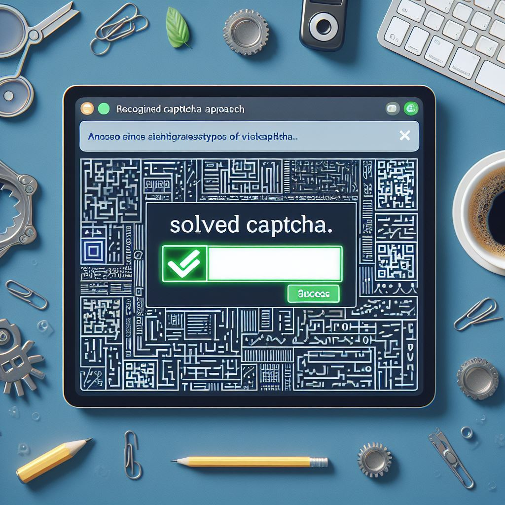

<div align="center">
  <a href="https://github.com/AmireNoori/SVG-Captcha_Solver">
    
  </a>

  <h3 align="center">SVG Captcha Solver</h3>

  <p align="center">
    A great tool for solving SVG type file captchas !
  </p>
</div>

<details>
  <summary>Table of Contents</summary>
  <ol>
    <li>
      <a href="#about-the-project">About The Project</a>
    </li>
    <li>
      <ul>
        <li><a href="#installation">Installation</a></li>
      </ul>
    </li>
    <li><a href="#usage">Usage</a></li>
    <li><a href="#license">License</a></li>
    <li><a href="#contact">Contact</a></li>
  </ol>
</details>


## About The Project

     

These types of captchas do not require image processing and making special models to extract letters and image-to-text models. Because these types of captchas do not have an image nature, these captchas are a type of SVG code that, by having a decoder model, You can return the code to the adjusted text, I gave a more complete explanation of this function below .

This function converts an SVG file to text using a model defined as a string within the class :

  1- Reading the model: First, we load the model, which is defined as a Base64-encoded string within the class, and decode it to a JSON string.

  2- Reading the SVG file: Next, we read the text of the SVG file and store it in a string.

  3- Parsing the SVG text: We parse the SVG text using the minidom library in Python to make it easier to work with.

  4- Finding path elements without stroke: Among the path elements in the SVG file, we find those that do not have a stroke. Elements with a stroke usually represent visible text in the image, and we don't need them for the purpose of copying.

  5- Parsing the paths: For each path without a stroke, we examine the path coordinates and associate them as input patterns to the relevant model.

  6-  Generating text based on the model: Based on the given model, we convert each input pattern into a corresponding letter or number and add it to a loop list.

  7-  Combining letters and numbers: We combine the letters and numbers resulting from the conversion of paths and return a final string as the ultimate answer.

This process allows the user to extract hidden text by sending an SVG file containing hidden code and using the associated model to extract it.

### Installation

1. Clone the repo
   ```sh
   git clone https://github.com/AmireNoori/SVG-Captcha-Solver
   ```

This tool does not use additional libraries and all modules like `base64` , `xml` and etc are built-in in python


## Usage

This tool is written in the form of a library that you can easily import and use in your script or bot.

* An example of how to use :

_Create a `main.py` file and enter the following codes in it._

* Example
  ```sh
  from SVG_Captcha_Solver import SvgCaptchaSolver

  solver = SvgCaptchaSolver()

  result = solver.solve_captcha("SVG FILE PATH") #img/captcha.svg

  print(result)
  ```
* Terminal
  ```sh
  python main.py
  ```

* Output
  ```sh
  g7TdR
  ```


## License

This project is licensed under the [MIT License](LICENSE).

### MIT License

MIT License

Copyright (c) [2024] [Amir Noori]

Permission is hereby granted, free of charge, to any person obtaining a copy
of this software and associated documentation files (the "Software"), to deal
in the Software without restriction, including without limitation the rights
to use, copy, modify, merge, publish, distribute, sublicense, and/or sell
copies of the Software, and to permit persons to whom the Software is
furnished to do so, subject to the following conditions:

The above copyright notice and this permission notice shall be included in all
copies or substantial portions of the Software.

THE SOFTWARE IS PROVIDED "AS IS", WITHOUT WARRANTY OF ANY KIND, EXPRESS OR
IMPLIED, INCLUDING BUT NOT LIMITED TO THE WARRANTIES OF MERCHANTABILITY,
FITNESS FOR A PARTICULAR PURPOSE AND NONINFRINGEMENT. IN NO EVENT SHALL THE
AUTHORS OR COPYRIGHT HOLDERS BE LIABLE FOR ANY CLAIM, DAMAGES OR OTHER
LIABILITY, WHETHER IN AN ACTION OF CONTRACT, TORT OR OTHERWISE, ARISING FROM,
OUT OF OR IN CONNECTION WITH THE SOFTWARE OR THE USE OR OTHER DEALINGS IN THE
SOFTWARE.

© [Amir Noori](https://github.com/AmireNoori)

## Contact

Amir Noori - [@AmireNoori1](https://t.me/AmireNoori1) - noorifardam@gmail.com

Project Link: [https://github.com/AmireNoori/SVG-captcha-Solver](https://github.com/AmireNoori/SVG-captcha-Solver)
